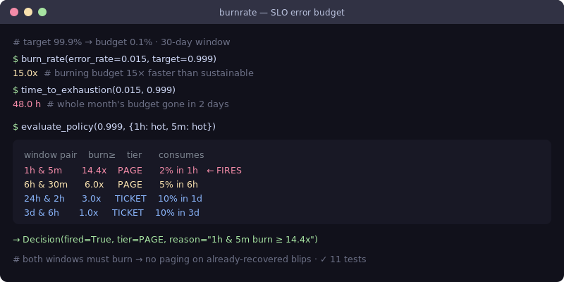

# burnrate — SLO error-budget & burn-rate engine

[](https://github.com/JCreatesGH/slo-burn-rate/actions)
[](https://www.python.org/)
[](LICENSE)

The math behind good SLO alerting: error budgets, burn rates, time-to-exhaustion, and **multi-window multi-burn-rate** alert decisions following the Google SRE Workbook. Zero dependencies, works with metrics from Prometheus, Datadog, Dynatrace, or anywhere.



## Install

```bash
pip install burnrate
```

## Use it

```python
from burnrate import burn_rate, time_to_exhaustion, evaluate_policy, AlertTier

burn_rate(error_rate=0.015, target=0.999)        # 15.0  (burning 15× too fast)
time_to_exhaustion(0.015, 0.999)                 # 48.0 hours until the budget is gone

decision = evaluate_policy(target=0.999, error_rates={
    1: 0.015, 5/60: 0.015,     # 1h and 5m windows both hot
    6: 0.0,   30/60: 0.0,
})
decision.fired   # True
decision.tier    # AlertTier.PAGE
decision.reason  # "1h & 5m burn >= 14.4x"
```

Derive thresholds (and see where the standard table comes from):

```python
from burnrate import burn_rate_threshold, remaining_budget

burn_rate_threshold(0.02, alert_window_hours=1)   # 14.4  → "2% of budget in 1h"
remaining_budget(0.25)                            # 0.75  → 75% of the budget left
```

`evaluate_policy(..., windows=my_windows)` accepts a custom window table.

## CLI

Installing the package adds a `burnrate` command (exits `1` when over budget, so it can gate CI):

```bash
$ burnrate --target 0.999 --error-rate 0.015 --window-hours 1
SLO target:         99.900%
error budget:       0.001000
observed error:     0.015000
burn rate:          15.00x   (OVER budget)
time to exhaustion: 48.0h
budget consumed:    2.08% (over 1h)
```

Add `--json` for machine-readable output.

## Why multi-window

A single-window alert either fires too late (long window) or too noisily (short window). The standard fix pairs them: the **long window** confirms the burn is real, and the **short window** confirms it's *still happening* — so you don't get paged for an incident that already recovered.

| Long / short | Burn ≥ | Tier | ~Budget consumed |
|--------------|--------|------|------------------|
| 1h / 5m | 14.4× | page | 2% in 1h |
| 6h / 30m | 6× | page | 5% in 6h |
| 24h / 2h | 3× | ticket | 10% in 1d |
| 3d / 6h | 1× | ticket | 10% in 3d |

`evaluate_policy` returns the most severe alert that fires across all pairs.

## Development

```bash
pip install -e .[dev] && python -m pytest -q   # 19 tests
```

## License

MIT
